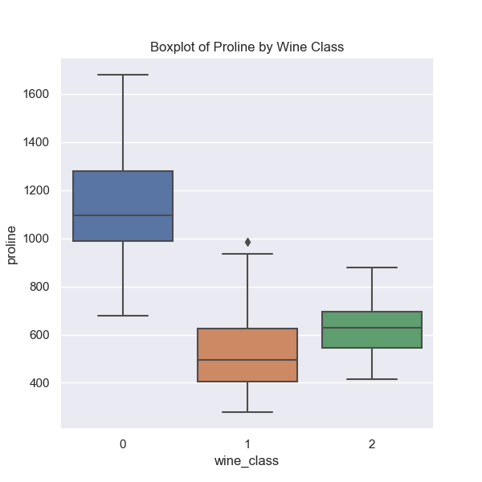
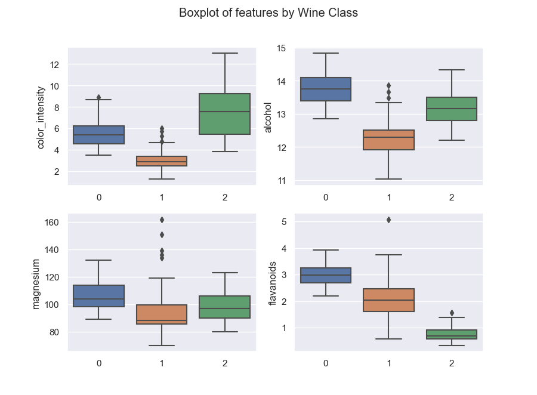
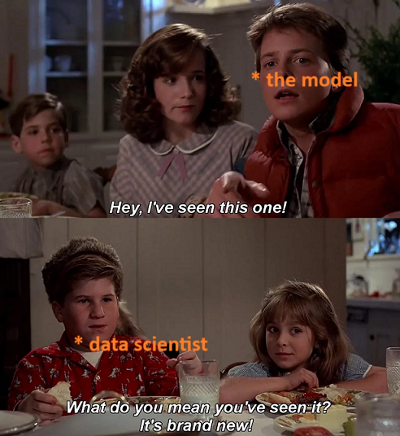

# Linear Modeling

Linear models fit the data by identifying a straight line which best captures the variance in the data. In general, the linear model is used in regression tasks where the output variable is a continuous variable as opposed to a discrete variable. Classification tasks can use an underlying straight-line equation to fit the data and predict discrete classes.

## Regression

In machine learning, regression tasks are those where the outcome (target) variable is continuous. For example, we might be predicting stock prices, units of product sold, total points scored in a game, etc.

For an example of the linear regression model, consider this model which uses [Advertising data]( https://www.kaggle.com/datasets/thorgodofthunder/tvradionewspaperadvertising) from Kaggle.


Once the Advertising data is loaded into the `data` variable as a pandas DataFrame, the modeling can done using a few simple lines of code using the `LinearRegression` class from scikit-learn:

```python
features = ['TV']; target = 'Sales'
X = data[features]
y = data[target]
model = LinearRegression().fit(X, y)
```

This model allows us to estimate how the dependent variable (Sales) changes as the independent variable (TV advertising) changes. Behind the hood, scikit-learn uses matrix multiplication to estimate the model parameters.

This **simple linear regression** model we just trained has a co-efficient of 0.055 and an intercept of 6.97.<br>
Since the intercept is 6.97, spending no money on TV advertising would still result in 6.97 units of the product sold. The co-efficient being positive means that spending on TV advertising increases the sales, and the marginal increase in sales of TV advertising by $1 is an additional 0.055 units of product. **The interpretation of linear models being so straightforward is one of their biggest advantages.**

We can easily extend linear models to work with multiple predictor variables although plotting the straight line would be harder.
In the same Advertising data, we also have Radio and Newspaper advertising spends information.

Using all three variables in a **multiple linear regression** model does not look very different in code:

```python
features = ['TV', 'Radio', 'Newspaper']; target = 'Sales'
X = data[features]
y = data[target]
model = LinearRegression().fit(X, y)
```

This model has an intercept of 4.62, and co-efficients 0.05, 0.11, and 0.0003 for the three variables TV, Radio, and Newspaper respectively. Note that while the three predictors in this example are on similar scales, this might not always be the case. In the case of multiple linear regression as we just performed, this is ok, because the co-efficients in the model will take the scale into account, but this will become relevant when the co-efficients are not free to do so and we will revisit this later.

Interpreting a multiple linear regression is slightly trickier than a simple linear regression.

For instance, the co-efficient of 0.05 for TV spending means that increasing spending on TV advertising by $1 would increase sales by 0.05 units *given that* spending on Radio and Newspaper advertising is not impacted. The **assumption that the predictors are not correlated** is important to keep in mind, and is often not the case in the real world. For example, there might be an overall advertising budget which dictates spending on different channels.

This is a nice segue into the next section, where we will discuss the `Lasso` model which can help identify the most important (uncorrelated) predictors from our data.

### Regularisation

Machine learning models often have to optimise for both bias and variance to get the best results. **A model that has high bias is a model that underfits the data**, and therefore makes predictions which are not close to the actual target variable. A model with high bias changes little even if it is provided with more or different data to train on.

In contrast, **a model with high variance overfits the data** it trains on, and therefore it does not perform particularly well on data it has not seen previously. A model with high variance changes a lot if it is provided with different data to train on. This is undesirable because the application of machine learning models requires them to make predictions on data they have not been trained on.

The issue is that low bias models have high variance, and low variance models have high bias. Hence the need for optimisation.

Regularisation attemts to reduce the variance of a model by simplifying it.<br>
A particular model called the **Lasso** regularises the linear regression model by shrinking the regression coefficients towards zero. It does this by introducing a regularisation term (the L1 norm) in the model's objective so that the model does not merely try to fit the data in the best possible way, but does so with the constraint that the model co-efficients cannot be huge.

Lasso also has the added advantage that it tends to assign co-efficients of exactly zero to the predictors which reduces the number of predictors in the model. As Kevin from the TV show "The Office" put it, "Why waste time with lot predictor when few predictor do trick?"


A geometrical interpretation of the Lasso helps us understand why it tends to shrink model co-efficients to exactly zero. In [this YouTube video](https://youtu.be/0tfPuddPhEY), Robert Tibshirani, professor at Stanford and the person who developed Lasso regularisation explains exactly this.

To train a Lasso model using scikit-learn, it is sufficient to initialise an instance of the `Lasso` class rather than the `LinearRegression` class. Additionally, to control the strength of regularisation, there is a parameter `alpha` which Lasso accepts. A higher value of `alpha` implies more regularisation and therefore results in a model with more bias and less variance.

```python
features = ['TV', 'Radio', 'Newspaper']; target = 'Sales'
X = data[features]
y = data[target]
model = Lasso(alpha=1).fit(X, y)
```

With the Advertising data, this results in a model with an intercept of 4.75 and co-efficients 0.05, 0.10, and 0 for the three variables TV, Radio, and Newspaper respectively. Lasso has effectively produced a model with just two predictors instead of the three we started with, by shrinking the co-efficient of Newspaper spending to 0.

However, there is one crucial step we missed while training our Lasso model.<br>
We have not scaled our predictors. When we trained the simple linear regression model, the model accounted for predictors on different scales by adjusting co-efficients as required. However, in the Lasso model, we are artificially posing a restriction on model co-efficients. As such, **it becomes crucial that our predictors are on the same scale**.

To scale our features, we'll use the `StandardScaler` from scikit-learn.<br>
From the scikit-learn docs, what the Standard Scaler does is:

>Standardize features by removing the mean and scaling to unit variance.
>The standard score of a sample $x$ is calculated as:
>$$z = \frac {x-u}  s$$
>where $u$ is the mean of the training samples or zero if `with_mean=False`, and $s$ is the standard deviation of the training samples or one if `with_std=False`.

Training the Lasso model now looks like:

```python
features = ['TV', 'Radio', 'Newspaper']; target = 'Sales'
X = data[features]
y = data[target]
X = StandardScaler().fit_transform(X)
model = Lasso(alpha=1).fit(X, y)
```

Training a Lasso after scaling the predictors gives us a model with an intercept of 15.13 and co-efficients 3.71, 0.64, and 0 for the three predictors.

Here we must note that **interpreting the model has now become difficult**, because an increase in the first predictor (that the model was trained on) by 1 unit is not the same as increasing TV spending by $1. The variable TV spending had been standardized/scaled to create the predictor that the model was trained on. Sadly, checking the co-efficients and relying on our gut feeling for feedback about model performance has become difficult.

In the next section, we will therefore look at how we can quantify model performance.

### Evaluating Regression Models

We now need a measure for how good our model is and, for regression tasks, one of the most popular metrics is the **root mean squared error (RMSE)**.

RMSE considers the squared error for each prediction as the loss for that prediction, which means that predictions with very high error compared to the actual target are penalised heavily. The mean of the squared errors for all predictions is the mean squared error (MSE), and the square root of the MSE is the RMSE. Taking the square root helps in interpreting the measure, since squaring the prediction also squares the units from, say units_sold, to units_sold $^2$.

At this point, it is worth mentioning that one of the assumptions of linear regression is that errors are not dependent on the predictor variable. That is to say the errors do not vary with X, and the errors have a common variance. This assumption is known as **homoscedasticity of the target variable**.

In scikit-learn, the `mean_squared_error` function helps us compute this.
Once the model has been trained, we make predictions and then compute the RMSE.

```python
# makes predictions on training data
y_pred = model.predict(X)

# computes root mean squared error
rmse = mean_squared_error(y, y_pred, squared=False)
```

Note that, here, we are making predictions on the same data that was used to train the model. In general, this is a bad idea, since our objective is to train a model which performs well on data that it has not been trained on. Later, we will take a look at cross-validation, which can help us make predictions on data that the model was not trained on.

That said, the Lasso model we previously trained has an RMSE of 2.15.<br>
This means that, on average, our model's predictions are off target by 2.15 units, when making predicitons on the same data it was trained on.<br>
Almost certainly, the model's performance would be worse on data it has not been trained on, although we did reduce its variance to some extent by regularising it.

Armed with this metric, it is time to go beyond linear predictors.

### Beyond Linear Predictors

Extending scikit-learn's functionality to train polynomial regression models is surprisingly simple. In fact, it is exactly like training the linear regression model with polynomial features created from the original variables in a pre-processing step.


In code, this looks like

```python
poly = PolynomialFeatures(2)
features = ['TV', 'Radio', 'Newspaper']; target = 'Sales'
X = data[features]
y = data[target]

X = poly.fit_transform(X)

model = LinearRegression(fit_intercept=False).fit(X, y)
```

The `PolynomialFeatures` class from scikit-learn helps create higher-order variables from our initial predictors by creating polynomial combinations of all predictors with degree less than or equal to the specified degree, which in this case is 2.

That is to say, if we start with 3 variables ( $a, b, c$ ), the PolynomialFeatures instance with a specified degree of 2 returns a feature matrix with the following variables when we use the `.fit_transform()` method:<br>
[ $1, a, b, c, a^2, b^2, c^2, ab, bc, ca$ ]

You'll notice that one of the variables createed by PolynomialFeatures is the scalar 1.<br>
This variable now serves the same purpose as the intercept in the model, since it is a scalar and is independent of our original predictors. As a result, when we instantiate a LinearRegression model now, we set `fit_intercept=False` since we do not need an intercept in the model.<br>
Indeed, if we do not set this parameter to False, scikit-learn will "learn" the co-efficient of the scalar variable to be 0.

This model has an RMSE of 1.34, which means that we might have improved on the Lasso model we trained in a previous section by introducing higher order variables and interaction terms.<br>
On the contrary, this might also mean that what we have managed to do is overfit the data by increasing the complexity of the model, and we have managed to make the model worse.

Our objective with the model should not be to fit the training data, but to **approximate the true relationship between the predictors and the target variable**. Sometimes, this would mean using a linear regression model, and at other times, this would mean using a polynomial regression model.

In some cases, when the predictor variable that we have collected does not correlate with the target variable at all, it does not make sense to use this variable at all, irrespective of the modeling technique!

For example, it is possible to imagine a situation where a scatter plot between a feature and target looks something like this:


If we do fit a linear model on this data as we have done, that would produce an intercept and a slope of "best fit" but this does a very poor job of approximating the true relationship between the predictor and the target.

With that, we have the basics of regression covered and it's time to move on to classification.

## Classification

In machine learning, classification tasks are those where the target variable is discrete. For example, predicting whether or not a student will pass a course given number of hours studied is a task where there are only two possible outputs - Pass and Fail. This is an example of **binary classification**. If we were to formulate the problem as the final marks or grade the student achieves, that would have been a regression task. Another common example of a binary classification task is learning whether a given image is that of a cat or a dog.

We can also have a situation where the target has 3 or more categories. For example, if we had to identify the animal from images of cats, dogs, and horses, that would be a **multiclass classification** problem.

Let us consider the popular [Wine](https://archive.ics.uci.edu/dataset/109/wine) dataset, which contains information for 13 predictor features for three different classes of wine. The dataset is also available in scikit-learn's `datasets` module, and can be loaded using the `load_wine()` function as follows:

```python
X, y = load_wine(as_frame=True, return_X_y=True)
```

The above line of code returns the predictor variables as a pandas DataFrame, and the target variable as a pandas Series.

### EDA

**Exploratory Data Analysis** of the `proline` feature reveals the following **box plot**:



Box plots can be created using seaborn as follows:

```python
sns.boxplot(x=y, y=X["proline"])
```

A box plot shows a lot of information, so let's try to break this plot down.

From the seaborn documentation:<br>
>A box plot (or box-and-whisker plot) shows the distribution of quantitative data in a way that facilitates comparisons between variables or across levels of a categorical variable. The box shows the quartiles of the dataset while the whiskers extend to show the rest of the distribution, except for points that are determined to be “outliers” using a method that is a function of the inter-quartile range.

In our box plot shown above, we are comparing the distribution of the `proline` feature across the 3 classes of wine, labelled 0, 1, and 2 respectively. The three coloured *boxes* in the box plot show the lower and upper bounds of the **inter-quartile range** (IQR) which is the middle 50% of the data. The lower bound represents the 25 $^{th}$ percentile, whereas the upper bound represents the 75 $^{th}$ percentile of the data. The black horizontal line inside the box shows the median, or the 50 $^{th}$ percentile.

The vertical lines which extend from the boxes end with whiskers which denote (in the absence of outliers) the minimum and maximum values in the data. If there are outliers, the vertical line extends till 1.5 times the IQR, and any outliers are shown individually. In the plot above, the distribution of `proline` for wines of `class 1` has one outlier (at a value of around 1000), and is shown separately as a black dot (or diamond).

We can similarly explore more variables, and plot them:



We can see that most of these features have quite different distributions for each class of wine, and so it makes sense to expect that a model can learn to differentiate between the different classes of wine using this data.

### Modeling

To model this data, we'll use the `LogisticRegression` class from scikit-learn.

The training and predicting steps are very similar to the steps we followed for regression.

```python
# pre-processes input features
X = StandardScaler().fit_transform(X)

# models data
logistic = LogisticRegression(C=0.1)
logistic.fit(X, y)

# makes predictions
y_pred = logistic.predict(X)
```

The argument `C` controls regularisation. A lower value of C implies more regularisation.

In the case of regression, we evaluated the model performance using the RMSE metric.<br>
However, we cannot use the RMSE for clasification tasks, since the "distance" between the different classes of wine is not so apparent.

Instead, we can calculate the **accuracy** of the model to evaluate its performance.

Accuracy is a measure of how often the model predictions match the true labels. Therefore, the best accuracy a model can have is 1, which would mean all the predictions match the true labels.

We can import the `accuracy_score` function from scikit-learn's metrics module and use it to compute the model's accuracy.

```python
acc = accuracy_score(y, y_pred)
```

The model we just trained has an accuracy of 0.99!<br>
If that sounds too good to be true, we should check it. It is possible that we are over-fitting the data.

In the next section, let's look at one way to solve over-fitting and understand the true performance of our model.

### Cross-validation

Let's start by saying this: cross-validation (CV) is not limited to classification tasks. Indeed, it would have been a great idea to use cross-validation on the regression model we trained as well.

But what is cross-validation and do we need it?<br>
From Wikipedia,
>Cross-validation is a resampling method that uses different portions of the data to test and train a model on different iterations. It is mainly used in settings where the goal is prediction, and one wants to estimate how accurately a predictive model will perform in practice.

Let's understand the motivation for cross-validation.<br>
When we are measuring a model's performance by making predictions on the same observations that it was trained on, we are merely evaluating how good it is at _remembering_, not how well it has _learnt_ the data.

Here's how I imagine a conversation between a model and a data scientist when the model is making predictions on the training data:


Just like Marty McFly in Back to the Future, the model has little trouble predicting what the correct labels are, because it has already been trained on them!

**K-Fold CV** is a cross-validation technique where the data is split into K folds, using which the model is trained on K-1 folds and evaluated on the remaining 1 (stand-out) fold.<br>
This process is repeated for the model to be evaluated on all the K folds (where each time the model is trained on the other K-1 folds) and the average of all the model scores is considered a measure of the model's performance.

To get the CV scores for our Logistic regression model, scikit-learn provides the `cross_val_score` function. It can be implemented as follows:

```python
logistic = LogisticRegression(C=0.1)
scores = cross_val_score(logistic, X, y, cv=5, scoring='accuracy')

acc = np.mean(scores)
```

Here, we're using 5 folds for cross-validation, and we're using accuracy as the metric to score the model.

Using cross-validation, our model has an accuracy score of 0.98!<br>
Now, we can be confident that the model will perform well on data it has not been trained on.

With that, we've come to the end of Classification.

## Parting Thoughts

Here are a few more aspects of training machine learning models to think about:
1. While we discussed some of the assumptions of linear models, what other assumptions did we implicitly make in our analysis?
2. When we discussed the Lasso model, we noted that Lasso uses the L1 norm as the regularisation term. What are possible alternatives?<br>
_Hint_: check out the `Ridge` and `ElasticNet` classes from scikit-learn
3. What could be the potential drawbacks of using accuracy as a metric in classification tasks?<br>
_Hint_: two common alternatives to accuracy are **precision** and **recall**
4. What can be done to ensure reproducibility of machine learning code?<br>
_Hint_: check out the `random_state` argument, which should be available in most scikit-learn classes that are not deterministic

## Source Code

For more detailed code, check out the [repo](https://github.com/dvshnkr/mle/tree/main/src/linear-models).

## Recommended Reading

1. [Linear Models](https://scikit-learn.org/stable/modules/linear_model.html) documentation from scikit-learn
2. [An Introduction to Statistical Learning](https://www.statlearning.com/) textbook - chapters 3 (Linear Regression) and 4 (Classification)
