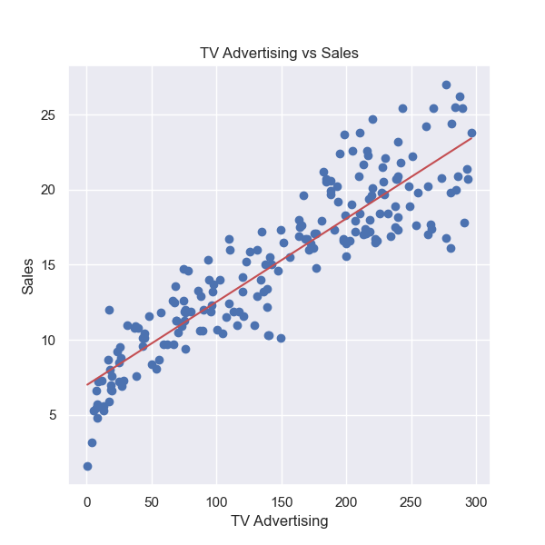
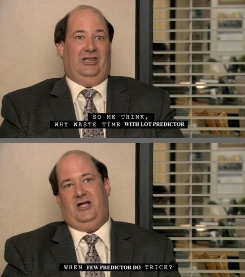
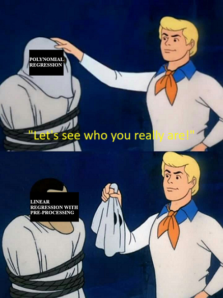
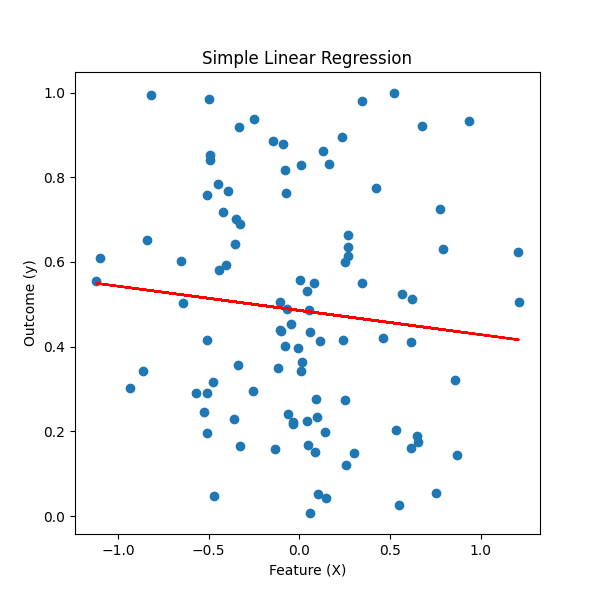

# Linear Modeling

Linear models fit the data by identifying a straight line which best captures the variance in the data. In general, the simple linear model is used in regression tasks where the output variable is a continuous variable as opposed to a discrete variable. Classification tasks can use an underlying straight-line equation to fit the data and predict classes given the input features.

## Regression

For an example of the linear regression model, consider this model which uses [Advertising data]( https://www.kaggle.com/datasets/thorgodofthunder/tvradionewspaperadvertising) from Kaggle.



Once the Advertising data is loaded into the `data` variable, the modeling can done using a few simple lines of code using the `LinearRegression` class from scikit-learn:

```python
features = ['TV']; target = 'Sales'
X = data[features]
y = data[target]
model = LinearRegression().fit(X, y)
```

This model allows us to estimate how the dependent variable (Sales) changes as the independent variable (TV advertising) changes. Behind the hood, scikit-learn uses matrix multiplication to estimate the model parameters.

This **simple linear regression** model we just trained has a co-efficient of 0.055 and an intercept of 6.97.<br>
Since the intercept is 6.97, spending no money on TV advertising would still result in 6.97 units of the product sold. The co-efficient being positive means that spending on TV advertising increases the sales, and the marginal increase in sales of TV advertising by $1 is an additional 0.055 unit of product. **The interpretation of linear models being so straightforward is one of their biggest advantages.**

We can easily extend linear models to work with multiple predictor variables although plotting the straight line would be harder.
In the same Advertising data, we also have Radio and Newspaper advertising spends information.

Using all three variables in a **multiple linear regression** model does not look very different in code:

```python
features = ['TV', 'Radio', 'Newspaper']; target = 'Sales'
X = data[features]
y = data[target]
model = LinearRegression().fit(X, y)
```

This model has an intercept of 4.62, and co-efficients 0.05, 0.11, and 0.0003 for the three variables TV, Radio, and Newspaper respectively. Note that while the three predictors in this example are on similar scales, this might not always be the case. In the case of multiple linear regression as we just performed, this is ok, because the co-efficients in the model will take the scale into account, but this will become relevant when the co-efficients are not free to do so and we will revisit this later.

Interpreting a multiple linear regression is slightly trickier than a simple linear regression.

For instance, the co-efficient of 0.05 for TV spending means that increasing spending on TV advertising by $1 would increase sales by 0.05 units *given that* spending on Radio and Newspaper advertising is not impacted. The **assumption that the predictors are not correlated** is important to keep in mind, and is often not the case in the real world. For example, there might be an overall advertising budget which dictates spending on different channels.

This is a nice segue into the next section, where we will discuss the `Lasso` model which can help identify the most important (uncorrelated) predictors from our data.

### Regularisation

Machine learning models often have to optimise for both bias and variance to get the best results. **A model that has high bias is a model that underfits the data**, and therefore makes predictions which are not close to the actual target variable. A model with high bias changes little even if it is provided with more or different data to train on.

In contrast, **a model with high variance overfits the data** it trains on, and therefore it does not perform particularly well on data it has not seen previously. A model with high variance changes a lot if it is provided with different data to train on. This is undesirable because the application of machine learning models requires them to make predictions on data they have not been trained on.

The issue is that low bias models have high variance, and low variance models have high bias. Hence the need for optimisation.

Regularisation attemts to reduce the variance of a model by simplifying it.<br>
A particular model called the **Lasso** regularises the linear regression model by shrinking the regression coefficients towards zero. It does this by introducing a regularisation term (the L1 norm) in the model's objective so that the model does not merely try to fit the data in the best possible way, but does so with the constraint that the model co-efficients cannot be huge.

Lasso also has the added advantage that it tends to assign co-efficients of exactly zero to the predictors which reduces the number of predictors in the model. As Kevin from the TV show "The Office" put it, "Why waste time with lot predictor when few predictor do trick?"



A geometrical interpretation of the Lasso helps us understand why it tends to shrink model co-efficients exactly to zero. In [this YouTube video](https://youtu.be/0tfPuddPhEY), Robert Tibshirani, professor at Stanford and the person who developed Lasso regularisation explains exactly this.

To train a Lasso model using scikit-learn, it is sufficient to initialise an instance of the `Lasso` class rather than the `LinearRegression` class. Additionally, to control the strength of regularisation, there is a parameter `alpha` which Lasso accepts. A higher value of `alpha` implies more regularisation and therefore results in a model with more bias and less variance.

```python
features = ['TV', 'Radio', 'Newspaper']; target = 'Sales'
X = data[features]
y = data[target]
model = Lasso(alpha=1).fit(X, y)
```

With the Advertising data, this results in a model with an intercept of 4.75 and co-efficients 0.05, 0.10, and 0 for the three variables TV, Radio, and Newspaper respectively. Lasso has effectively produced a model with just two predictors instead of the three we started with, by shrinking the co-efficient of Newspaper spending to 0.

However, there is one crucial step we missed while training our Lasso model.<br>
We have not scaled our predictors. When we trained the simple linear regression model, the model accounted for predictors on different scales by adjusting co-efficients as required. However, in the Lasso model, we are artificially posing a restriction on model co-efficients. As such, **it becomes crucial that our predictors are on the same scale**.

To scale our features, we'll use the `StandardScaler` from scikit-learn.<br>
From the scikit-learn docs, what the Standard Scaler does is:

Standardize features by removing the mean and scaling to unit variance.
The standard score of a sample $x$ is calculated as:
$$z = \frac {x-u}  s$$
where $u$ is the mean of the training samples or zero if `with_mean=False`, and $s$ is the standard deviation of the training samples or one if `with_std=False`.

Training the Lasso model now looks like:

```python
features = ['TV', 'Radio', 'Newspaper']; target = 'Sales'
X = data[features]
y = data[target]
X = StandardScaler().fit_transform(X)
model = Lasso(alpha=1).fit(X, y)
```

Training a Lasso after scaling the predictors gives us a model with an intercept of 15.13 and co-efficients 3.71, 0.64, and 0 for the three predictors.

Here we must note that **interpreting the model has now become difficult**, because an increase in the first predictor (that the model was trained on) by 1 unit is not the same as increasing TV spending by $1. The variable TV spending had been standardized/scaled to create the predictor that the model was trained on. This makes it difficult to know how good the model really is, since, sadly, checking the co-efficients and relying on our gut feeling for feedback about model performance has become difficult.

In the next section, we will therefore look at how we can quantify model performance.

### Evaluating Regression Models

We now need a measure for how good our model is and, for regression tasks, one of the most popular metrics is the **root mean squared error (RMSE)**.

RMSE considers the squared error for each prediction as the loss for that prediction, which means that predictions with very high error compared to the actual target are penalised heavily. The mean of the squared errors for all predictions is the mean squared error (MSE), and the square root of the MSE is the RMSE. Taking the square root helps in interpreting the measure, since squaring the prediction also squares the units from, say units_sold, to units_sold $^2$.

At this point, it is worth mentioning that one of the assumptions of linear regression is that errors are not dependent on the predictor variable. That is to say the errors do not vary with X, and the errors have a common variance. This assumption is known as **homoscedasticity of the target variable**.

In scikit-learn, the `mean_squared_error` function helps us compute this.
Once the model has been trained, we make predictions and then compute the RMSE.

```python
# makes predictions on training data
y_pred = model.predict(X)

# computes root mean squared error
rmse = mean_squared_error(y, y_pred, squared=False)
```

Note that, here, we are making predictions on the same data that was used to train the model. In general, this is a bad idea, since our objective is to train a model which performs well on data that it has not been trained on.

That said, the Lasso model we previously trained has an RMSE of 2.15.<br>
This means that, on average, our model's predictions are off target by 2.15 units, when making predicitons on the same data it was trained on.<br>
Almost certainly, the model's performance would be worse on data it has not been trained on, although we did reduce its variance to some extent by regularising it.

Armed with this metric, it is time to go beyond linear predictors.

### Beyond Linear Predictors

Extending scikit-learn's functionality to train polynomial regression models is surprisingly simple. In fact, it is exactly like training the linear regression model with polynomial features created from the original variables in a pre-processing step.



In code, this looks like

```python
poly = PolynomialFeatures(2)
features = ['TV', 'Radio', 'Newspaper']; target = 'Sales'
X = data[features]
y = data[target]

X = poly.fit_transform(X)

model = LinearRegression(fit_intercept=False).fit(X, y)
```

The PolynomialFeatures class from scikit-learn helps create higher-order variables from our initial predictors by creating polynomial combinations of all predictors with degree less than or equal to the specified degree, which in this case is 2.

That is to say, if we start with 3 variables ( $a, b, c$ ), the PolynomialFeatures instance with a specified degree of 2 returns a feature matrix with the following variables when we use the `.fit_transform()` method:<br>
[ $1, a, b, c, a^2, b^2, c^2, ab, bc, ca$ ]

You'll notice that one of the variables createed by PolynomialFeatures is the scalar 1.<br>
This variable now serves the same purpose as the intercept in the model, since it is a scalar and is independent of our original predictors. As a result, when we instantiate a LinearRegression model now, we set `fit_intercept=False` since we do not need an intercept in the model.<br>
Indeed, if we do not set this parameter to False, scikit-learn will "learn" the co-efficient of the scalar variable to be 0.

This model has an RMSE of 1.34, which means that we might have improved on the Lasso model we trained in a previous section by introducing higher order variables and interaction terms.

On the contrary, this might also mean that what we have managed to do is overfit the data by increasing the complexity of the model, and we have managed to make the model worse.

Our objective with the model should not be to fit the training data, but to **approximate the true relationship between the predictors and the target variable**. Sometimes, this would mean using a linear regression model, and at other times, this would mean using a polynomial regression model.

In some cases, when the predictor variable that we have collected does not correlate with the target variable at all, it does not make sense to use this variable at all, irrespective of the modeling technique!

For example, it is possible to imagine a situation where a scatter plot between a feature and target looks something like this:



If we do fit a linear model on this data as we have done, that would produce an intercept and a slope of "best fit" but this does a very poor job of approximating the true relationship between the predictor and the target.

With that, we have the basics of regression covered, and it's time to move on to classification.

## Classification
